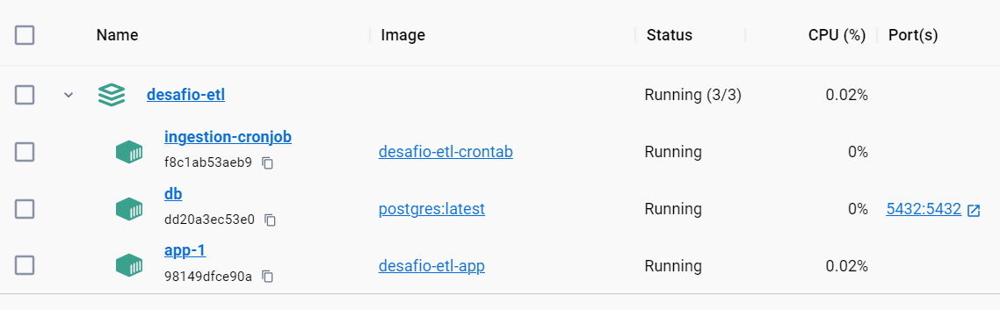
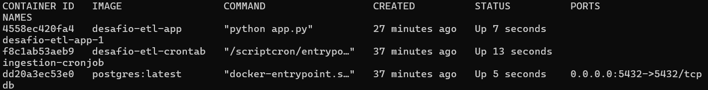
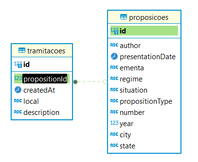
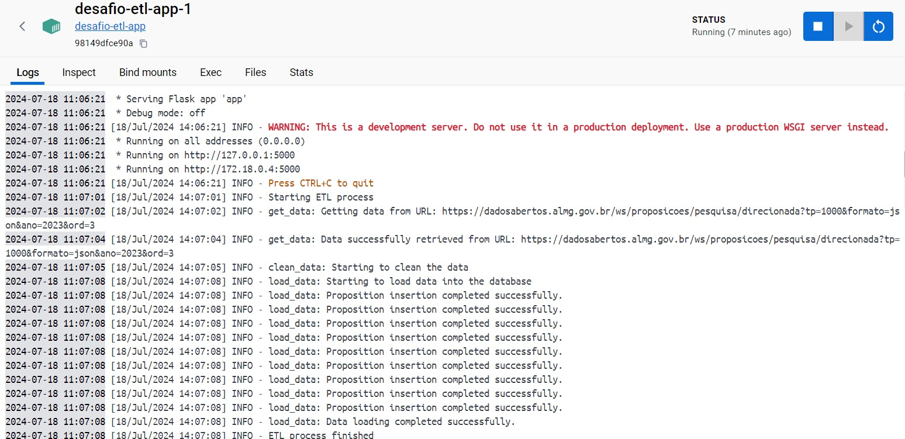

# Desafio de Engenharia de Dados | ETL de Proposições Legislativas

## Visão Geral
Este projeto consiste em uma aplicação que coleta dados de uma API e realiza o processo de ETL (Extract, Transform, Load) em um banco de dados PostgreSQL. O projeto envolve três containers:

- Banco de Dados PostgreSQL
- API Flask para Funções de ETL
- Container Alpine com Cronjob

Este projeto utiliza Docker Compose para orquestrar três containers distintos que trabalham juntos para realizar o processo de ETL. A aplicação Flask expõe um endpoint que é chamado periodicamente pelo cronjob no container Alpine. Os dados coletados são processados e inseridos no banco de dados PostgreSQL.

A ideia de trazer um container com o cronjob e aplicação ser servida a partir de uma API em outro container, permite que o container da aplicação permaneça vivo e com baixo consumo de memória e que possamos configurar o cronjob separadamente. Além disso, os logs serão exibidos para os 3 containers de forma individual trazendo mais organização e facilidade de monitoramento. 

## Passos para configuração e execução

1. Clone o repositório:

```
git clone https://github.com/joaolevi/desafio-etl.git
cd desafio-etl
```

2. Configurando o cronjob:

O cronjob já está configurado para fazer uma requisição para a API que fará o ETL a cada minuto. Para alterar esse intervalo entre as chamadas, você deve alterar o arquivo `file` em `docker/crontab/files/file` com o tempo que achar necessário. 

Ex: Caso deseje rodar a cada uma vez por dia a meia noite é possível alterar de `* * * * *` para `0 0 * * *`. Isso permitirá que os dados sejam processados e inseridos diariamente.

3. Build os containers e inicie com o docker-compose:

```
docker-compose build
docker-compose up -d
```

Após efetuar essas etapas, é possível ver no Docker Desktop os 3 containers rodando cada um com seus logs específicos.



Ou, caso prefira, você pode verificar os containers com o comando `docker ps` no terminal.



O banco de dados pode ser conectado após a inicialização no `localhost` porta `5432` com usuário e senha `postgres:password`.

### Estrutura do projeto

```
.
├── docker-compose.yml
├── docker
│   ├── app
│   │   ├── Dockerfile
│   │   └── requirements.txt
│   └── crontab
│       ├── Dockerfile
│       ├── files
│       │   └── file
│       └── scripts
│           └── entrypoint.sh
├── app
│   ├──src
│   │   ├── db.py
│   │   └── etl.py
│   └── app.py
└── README.md

```

### Containers

#### Banco de Dados (PostgreSQL):

O banco `propositions_db` terá duas tabelas criadas a partir da conexão com a API onde uma delas se chama `proposicoes` que guarda as proposições enquanto a outra se chama `tramitacoes`.

A tabela `proposicoes` tem uma relação de um pra muitos com a tabela `tramitacoes` tal qual pode ser acessada a partir da foreing key `propositionId` assim como mostra o diagrama abaixo



Após o preechimento das tabelas é possível verificar os dados inseridos fazendo uma consulta a tabela com `select * from proposicoes` para receber todos os valores da tabela `proposicoes` ou se quisermos fazer uma consulta mais refinada para obter a quantidade de proposições por autor que foram realizadas a partir de 01/06/2024:

```
SELECT "Autor", COUNT(*) AS "Quantidade proposições"
FROM (
    SELECT a.author AS "Autor", a.number AS "Número Prop", b."createdAt"
    FROM proposicoes a
    INNER JOIN tramitacoes b ON a.id = b."propositionId"
    WHERE b."createdAt" > TO_DATE('2024-06-01', 'YYYY-MM-DD')
) subquery
GROUP BY "Autor";

```

E o resultado será:

```
Autor                                  |Quantidade proposições|
---------------------------------------+----------------------+
Deputado Ricardo Campos PT             |                     7|
Deputado Lucas Lasmar REDE             |                     2|
Deputada Maria Clara Marra PSDB        |                     3|
Deputado Fábio Avelar AVANTE           |                     6|
Deputado Doutor Paulo PATRIOTA         |                     8|
Comissão Educação, Ciência e Tecnologia|                     1|
Tribunal de Justiça                    |                    10|
Deputado Caporezzo PL                  |                     2|
```

#### API Flask (ETL):

Esse container hosperada uma API que ouve na porta 5000 e recebe requisições do container cron. Ao receber a requisição a aplicação iniciará o processo de ETL armazenando os dados processados no banco de dados que está rodando no container db.

A estrutura da aplicação é bem simples:

- src/db.py: arquivo que conterá a estrutura das tabelas
- src/etl.py: contêm as funções para efetuar o ETL
- app.py: conecta com o banco de dados e serve a API.

O processo de ETL é realizado em três etapas a partir das 3 funções `extract_data()`, `transform_data()` e `load_data()`. 

A extração é realiza pela função `extract_data()` fazendo-se uma requisição para a URL informada que devolve o dado cru o qual será enviado para a função `transform_data()` onde será processado. Por fim, ao finalizar a limpeza dos dados, eles são carregados no banco de dados a partir da função `load_data()`

Os dados são corretamente tipados durante o processamento e carregamento para garantir que não haja erros no momento da ingestão.

É possível ver os logs da aplicação no container. Foi utilizada a biblioteca `logger` seguindo o padrão de horário UTC + nome da função.



#### Cron:

Esse container é construído a partir de uma imagem do Alpine e tem configurado um cron que executará o comando do arquivo `file` para fazer uma requisição POST para a API do ETL.

## Docker-compose

Os containers são orquestrados pelo docker-compose a partir do arquivo docker-compose.yml.

Um volume é criado para o banco de dados de modo a permitir que mantenhamos os dados seguros para o caso de queda do container do banco.

## Demais observações

- Assim como solicitado, o processo de limpeza dos dados garante que não haverá espaços desnecessários nos arquivos.
- Com a constraint de unique key para o campo `proposicoes.number` garantimos que não haverá duplicidade de proposicoes na tabela.

## Pontos de melhoria

- Criação de um arquivo de variáveis de ambiente como `.env` ou `.yaml`;
- Bloqueio da rota de ETL através de criptografia por chave secreta permitindo que apenas o container cron consiga fazer essa chave.
- Criação de testes de ingestão no banco de dados;
- Rotina de backup do volume do banco de dados;
- Otimizar a verificação de duplicidade no momento anterior a inserção do banco. Atualmente é feita com o Pandas e a chamada da função `drop_duplicates()`. No caso de uma coleta muito grande, criar um dataframe só para usar essa função pode consumir grande parte da memória e deixar a execução mais lenta.